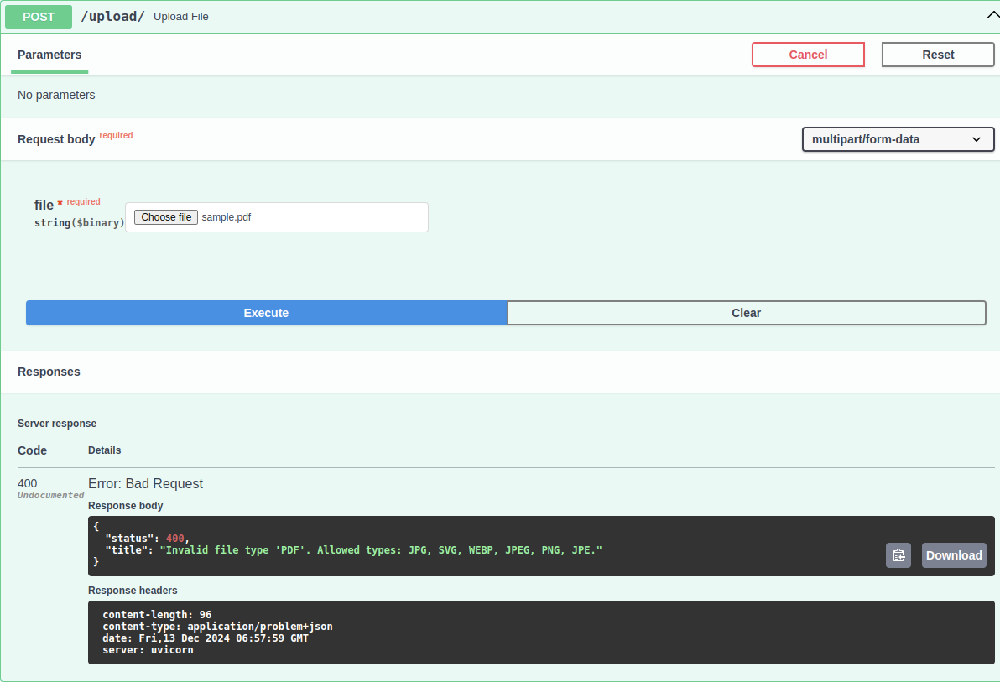
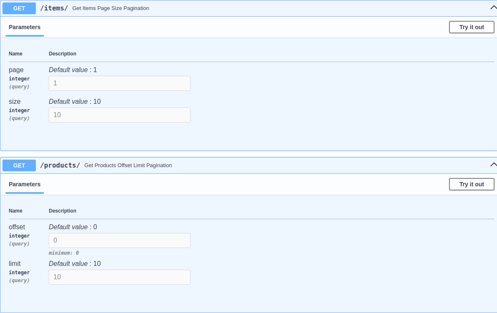
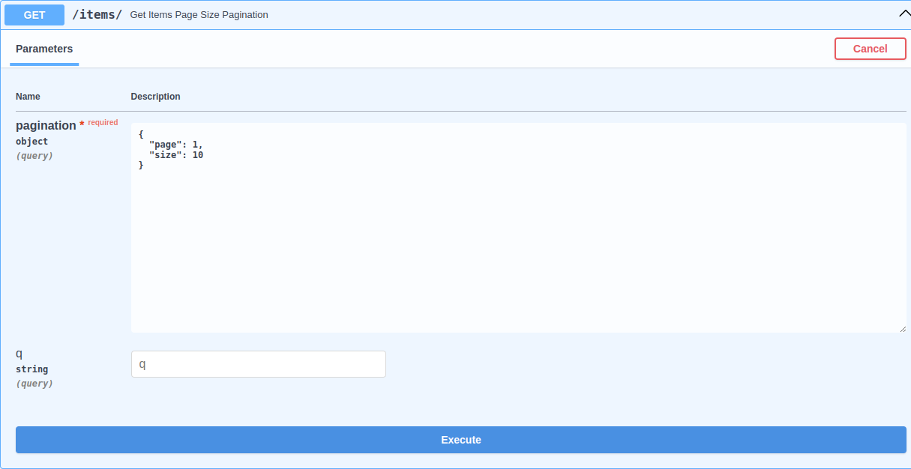
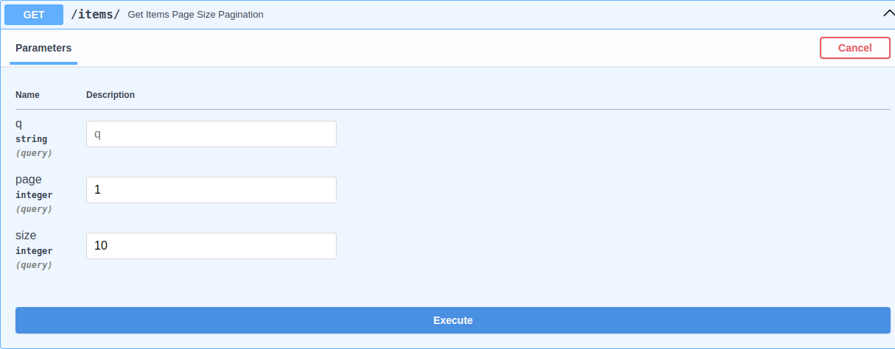

# Dependencies

FastAPI Batteries comes with some handful dependencies that are common in most FastAPI projects.

## File Validator

This dependency uses [python-magic](https://pypi.org/project/python-magic/) to accurately determine the file type of the uploaded file.

You can use this validator to:

- Validate the file type (via mime type)
- Validate File Size

=== "Example"

    ```py hl_lines="5-6 11-16 20"
    --8<-- "examples/fastapi/dependencies/file_validator__py313.py"
    ```

=== "Preview"

    

## Pagination Query Params

FastAPI allows using [Pydantic model as query parameter model](https://fastapi.tiangolo.com/tutorial/query-param-models/).

Thanks to that you can have reusable pagination query parameters. This is minimal but faster and when you pair it with our CRUD helper it becomes more powerful.

=== "Example"

    ```py hl_lines="5 11 16"
    --8<-- "examples/fastapi/dependencies/pagination__py313.py"
    ```

=== "Preview"

    

## Using with other query params

When you use Pydantic model schema along with other query params you'll get Pydantic model schema in request body which is wrong:

=== "Example"

    ```py hl_lines="12-13"
    --8<-- "examples/fastapi/dependencies/fastapi_pydantic_model_n_query_param_issue__py313.py"
    ```

=== "Preview"

    

This is limitation (or bug) from FastAPI. There's already [open issue](https://github.com/fastapi/fastapi/issues/12402) and [related discussions](https://github.com/fastapi/fastapi/issues/12402#issuecomment-2416720739) for this. However, we've nice workaround for [this](https://github.com/fastapi/fastapi/issues/12402#issuecomment-2520205504).

We just have to replace `Query()` with `Depends()` and it'll work as expected:

```diff
- pagination: Annotated[PaginationPageSize, Query()],
+ pagination: Annotated[PaginationPageSize, Depends()],
```

=== "Example"

    ```py hl_lines="12"
    --8<-- "examples/fastapi/dependencies/fastapi_pydantic_model_n_query_param_issue_workaround__py313.py"
    ```

=== "Preview"

    
