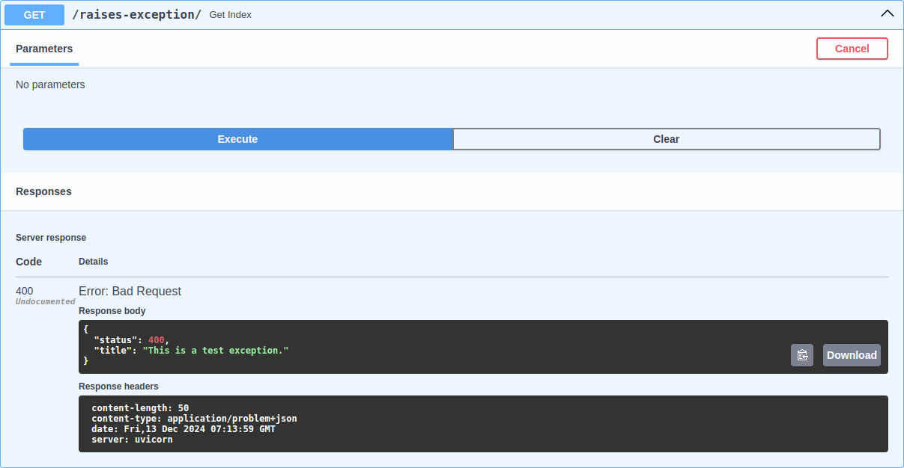

# Exceptions

## APIException

Raising exception with useful error message is a good practice and there's [RFC 9457](https://www.rfc-editor.org/rfc/rfc9457.html) that suggests how to do it. FastAPI has this on its [roadmap](https://github.com/fastapi/fastapi/issues/10370) however it's not implemented yet.

FastAPI batteries custom exception class `APIException` that can be used to raise exceptions following RFC 9457.

=== "Example"

    ```py hl_lines="3 7 12-15"
    --8<-- "examples/fastapi/exceptions/api_exception__py313.py"
    ```

=== "Preview"

    

Right now, It only handles `APIException` and convert to RFC 9457 compliant response. I'm planning to also handle Pydantic's validation error and convert to RFC 9457 compliant response. If you have any other suggestions, please let me know.
