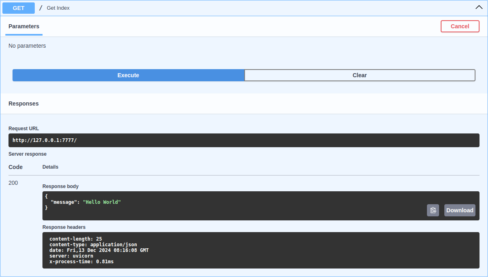

# Middlewares

FastAPI (and starlette) already provides some useful middlewares however along with that I prefer some custom solution that can be used with my tech stack.

## SQLAlchemy Query Count

This middleware returns total number of queries executed for each request via response header `X-DB-Query-Count`.

=== "Example"

    ```py hl_lines="5 13"
    --8<-- "examples/fastapi/middlewares/query_count__py313.py"
    ```

=== "Preview"

    

## Request Process Time

This middleware returns execution time of each request via response header `X-Process-Time`.

=== "Example"

    ```py hl_lines="3 7"
    --8<-- "examples/fastapi/middlewares/request_process_time__py313.py"
    ```

=== "Preview"

    
